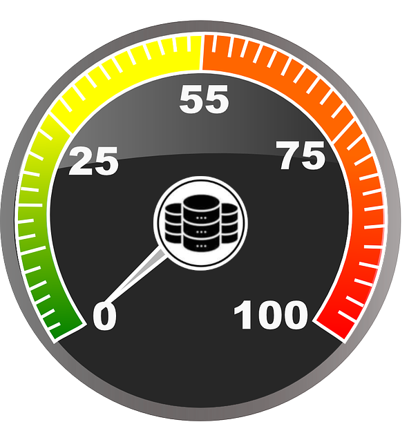

# Sql Tracer

<!-- <p float="left">
  
  
  
  
</p> -->


<p align="center">
  </img>
</p>

A small tool to know how fast your database responds.

## Settings

|name| sample value |description|
|:--|:--|:--|
|-a| seus_01 | an alias of the server|
|-h| 10.10.20.30 | database host like localhost, 127.0.0.1, an ip, etc|
|-p| 1521 | database port: 1521 for oracle, 3306 for mysql, etc|
|-u| root | database connection user|
|-n| employee_db | database name. For oracle set the service name|
|-r| /tmp/database_connection_report.csv  | a location to the desired csv report|
|-i| 15 | value in seconds to be used a interval of execution|

The password is a special and sensible value, so we cannot set it directly. You will

For linux/mac

```
export sql_tracer_database_password=admin123
```

And for windows you can use the [Environment Variable Manager](https://github.com/usil/sql_tracer/wiki/Environment-Variables-Manager)

## Usage

- Dowload the latest release from [here](https://github.com/usil/sql_tracer/releases)
- Configure the password as was explained previously
- Open a shell and run this


**Linux/Mac**

```
./sql_tracer -a seus_01 -p 1521 -h 10.10.20.30  -u system  -n xe -r /tmp/database_connection_report.csv -i 5
```

**Windows**

```
sql_tracer.exe -a seus_01 -p 1521 -h 10.10.20.30  -u system  -n xe  -r C:\\Users\\Jane\\Desktop\\database_connection_report.csv -i 5
```


## Report

- client ip
- client alias
- ping start datetime
- ping end datetime
- status (success or error)
- elapsed time in millis
- error summary (one line)

All the metrics will be stored in the provided report location. Example:


## Requirements

- Go (https://go.dev/doc/install)

## Dependencies

```
go get github.com/sijms/go-ora/v2
```

## Run for developers

Set the database password as was explained.

Then execute for **Linux/Mac**

```
go run src/main/go/sql_tracer.go -a seus_01 -p 1521 -h 10.10.20.30  -u system  -n xe -r /tmp/database_connection_report.csv -i 5
```

And for windows

```
go run src/main/go/sql_tracer.go -a seus_01 -p 1521 -h 10.10.20.30  -u system  -n xe  -r C:\\Users\\Jane\\Desktop\\database_connection_report.csv -i 5
```

## Build

**Linux/Mac**

```
go build -o build/sql_tracer src/main/go/sql_tracer.go
```

**Windows**

```
go build -o build/sql_tracer.exe src/main/go/sql_tracer.go
```

If no errors, you will find the executable in the build folder. Then you could use it in a machine without **go**

## Error codes

|code| description|
|:--|:--|
|6660| I was not able to enter to that catch :/ |
|6661| usually bad host or credentials |
|6662| Connected but query validation got an error |
|66650| report exist but cannot be accesed to append it |

## Advanced settings

For notitifations, templates, plugins, etc go to the [wiki](https://github.com/usil/sql_tracer/wiki)

## Acknowledgments

- https://www.needpix.com/photo/102486/speedometer-tachometer-speed-indicator-speed-speedo-measure

## Contributors

<table>
  <tbody>    
    <td>
      
      <br />
      <label><a href="http://jrichardsz.github.io/">JRichardsz</a></label>
      <br />
    </td>
  </tbody>
</table>